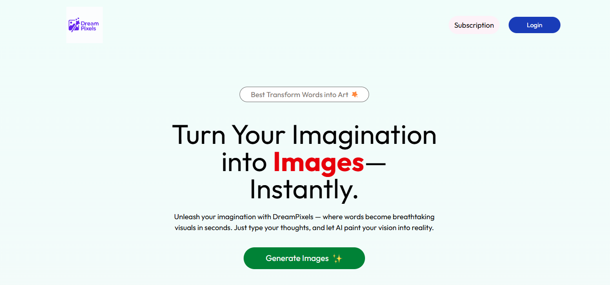
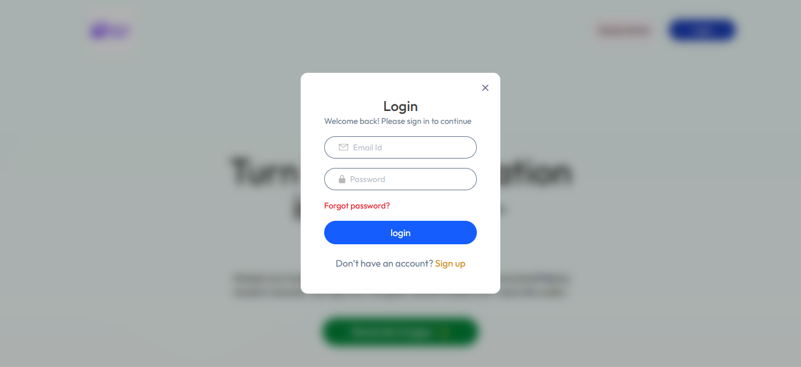
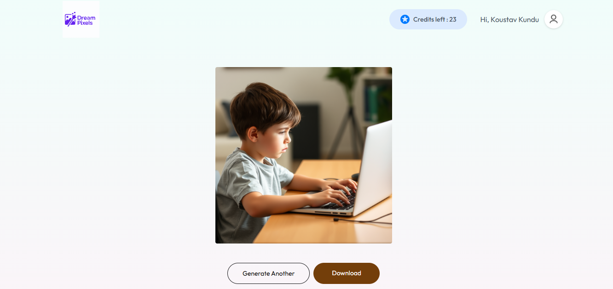
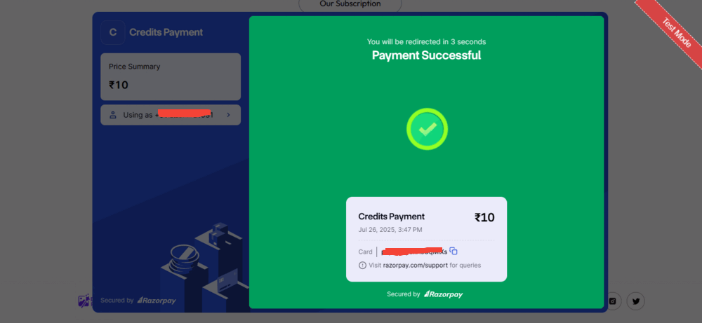

# 🎨 Dream Pixels

**Dream Pixels** is a full-stack AI-powered image generation platform where users can create, view, and manage their generated images. It combines powerful backend logic with a sleek frontend, offering a modern and responsive UI.

---

## 🚀 Live Demo

🔗 **Try it out:** [Live Demo](https://dream-pixels-8rjq.vercel.app/)

---

## 📸 Screenshot

- Home Page


- Login Page


- Generate Page


- Payment Page


---

## 🛠️ Tech Stack

### 🔹 Frontend
- **React.js** – Component-based UI library
- **Tailwind CSS** – Utility-first responsive styling
- **React Router** – Client-side routing
- **Framer Motion** – Smooth animations
- **React Toastify** – Notification handling

### 🔹 Backend
- **Node.js + Express.js** – API endpoints and server logic
- **MongoDB + Mongoose** – NoSQL database with schema modeling
- **JWT (JSON Web Tokens)** – Authentication and secure sessions
- **Razorpay** – Payment integration for credit purchase
- **dotenv** – Environment variable configuration
- **CORS** – Cross-origin request handling

---

## ✨ Features


- 🖼️ **AI Image Generation**: Generate images from prompts using OpenAI’s model
- 💳 **Credit System**: Users can purchase credits to generate more images
- 🔐 **User Authentication**: Secure login/signup using JWT
- 📁 **Image Storage**: View previously generated images
- 💻 **Responsive UI**: Mobile-friendly and modern interface
- 📦 **Clean REST API**: Well-structured backend endpoints

---

## 🧰 Getting Started

Follow these steps to set up the project locally:

### 1. Clone the Repository

```bash
git clone https://github.com/your-username/DreamPixels.git
cd DreamPixels
````
### 2. Setup Backend

```bash
cd server
npm install
npm run server
```

### 3. Create a .env file and add:

```bash
PORT=4000
MONGODB_URL=your_mongodb_connection_string
JWT_SECRET=your_jwt_secret
RAZORPAY_KEY_ID=your_razorpay_key_id
RAZORPAY_SECRET=your_razorpay_secret

```

### 4. Setup Frontend

```bash
cd client
npm install
npm run dev
```

### 5. Create a .env file and add:

```bash
VITE_BACKEND_URL=https://your-backend-url.vercel.app
VITE_RAZORPAY_KEY_ID=your_razorpay_key_id

```

## 🌟 Credits

This project was created with ❤️ by Koustav Kundu.
If you like it, feel free to ⭐ this repository and share!